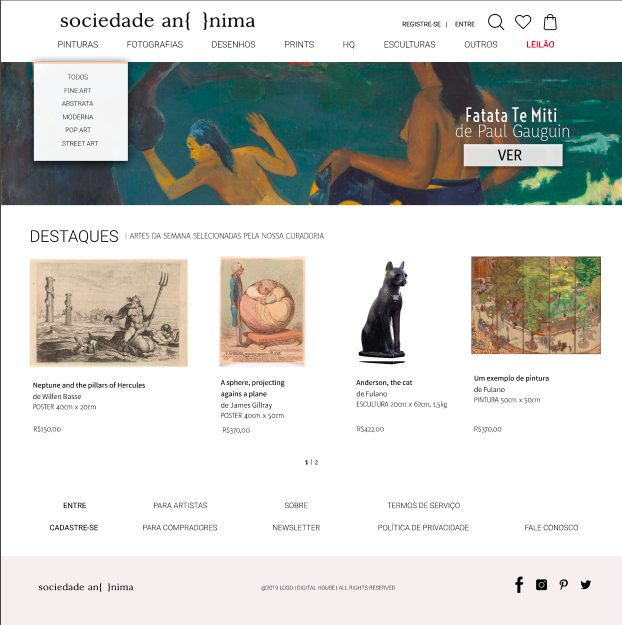

# Sociedade An { } nima

## O que é?
É um portal que visa fomentar o contato entre artistas independentes e pessoas interessadas em suas artes.

- - -
##  Por que?
A maioria dos portais (aka marketplaces) são muito impessoais e tem o único objetivo de intermediar o comércio entre as partes, perdendo a beleza da arte.

- - -

## Como funciona?
loren ipsun

- - -
## Tecnologias

| TECNOLOGIA | DESCRIÇÃO |
|:----------:|:---------:|
| HTML5      | loren     |
| CSS3       | loren     |
| PHP        | loren     |

## Como ficou

## Contribuidores
* Cárita
* João
* Teresa
* Wilson Domingos
* Wilson Faustino